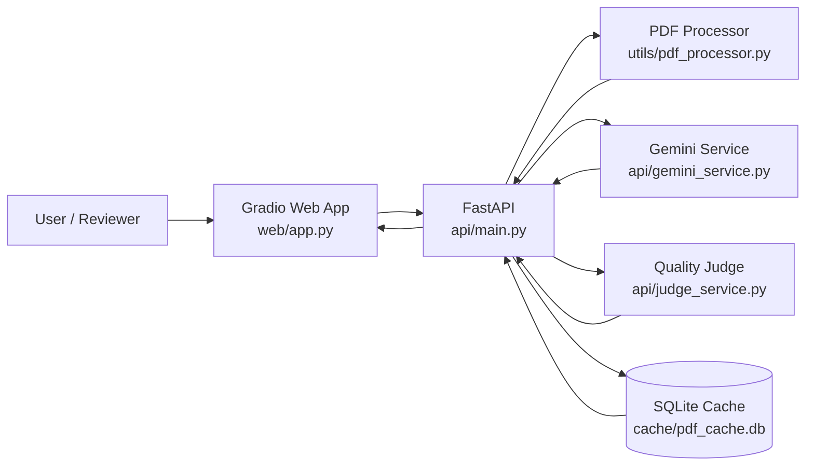
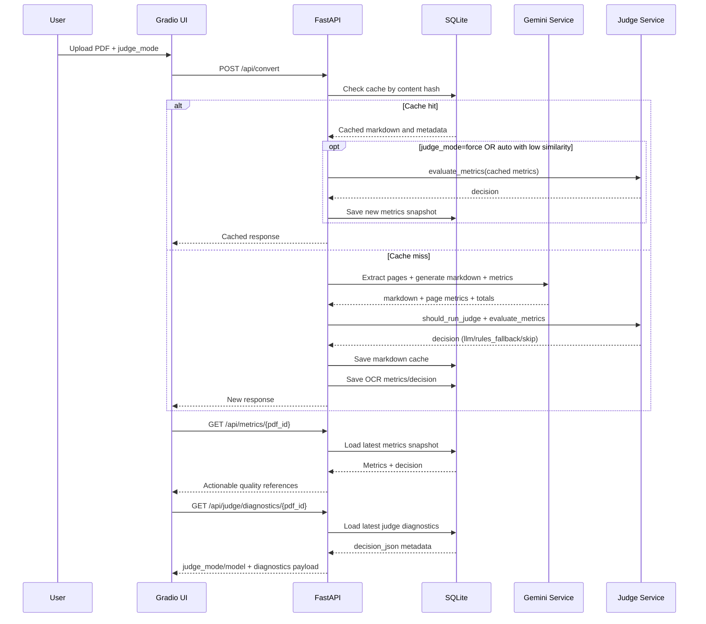
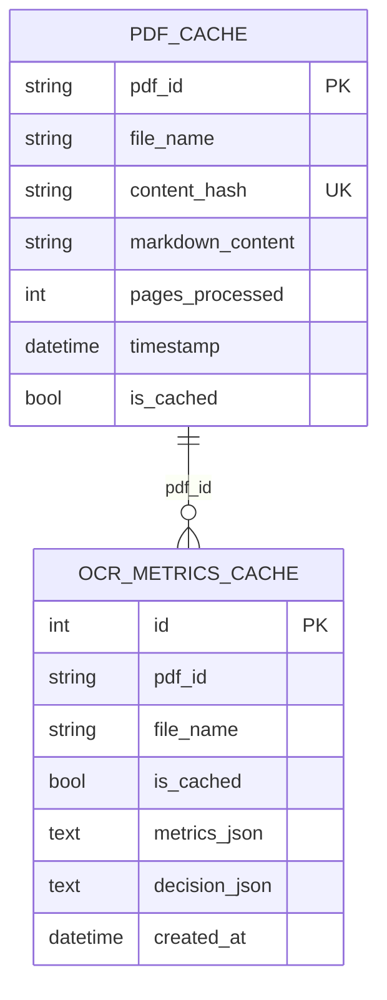

# ProjectSight OCR Service - Architecture and Onboarding

## 1. Solution Architecture

### 1.1 High-level view



### 1.2 Core runtime flow (convert request)



### 1.3 Data layer model



### 1.4 Key design choices

- Content-based caching using SHA256 avoids duplicate OCR work.
- Metrics are stored as snapshots to keep a quality audit trail over time.
- Judge execution is configurable at policy level and overridable per request (`auto`, `force`, `skip`).
- Judge uses Gemini 3.1 Pro for final decision when available; deterministic rules are used as fallback.
- Human review is guided via page-level references (`review_pages`, `page_review_references`).
- Judge diagnostics are persisted with decisions for traceability in API/UI.

## 2. Onboarding (setup + flow + key endpoints)

## 2.1 Setup

### Prerequisites

- Python 3.10+
- Valid Gemini API key
- Windows PowerShell or equivalent shell

### Install

```bash
git clone <repo-url>
cd projectsight-ocr-service
python -m venv .venv
.\.venv\Scripts\activate
uv pip install -e .
```

### Configure environment

Create `.env` from `.env.example` and set at least:

```ini
GEMINI_API_KEY=your_api_key_here
SYSTEM_PROMPT=./prompts/system_prompt.prompty
GEMINI_MODEL=gemini-3.1-flash-preview
GEMINI_SMALL_DOC_MODEL=gemini-3.1-flash-preview
GEMINI_LARGE_DOC_MODEL=gemini-3.1-flash-lite-preview
GEMINI_LARGE_DOC_PAGE_THRESHOLD=100
MAX_FILE_SIZE_MB=30
DATABASE_PATH=./cache/pdf_cache.db
API_HOST=127.0.0.1
API_PORT=8000
GRADIO_HOST=127.0.0.1
GRADIO_PORT=7860

# Judge controls
JUDGE_MODEL=gemini-3.1-pro-preview
JUDGE_ENABLED=true
JUDGE_SIMILARITY_THRESHOLD=0.95
JUDGE_ONLY_NEW_DOCUMENTS=true
JUDGE_SAMPLE_RATE=0.0
```

### Run

Terminal 1:

```bash
uv run uvicorn api.main:app --reload --host 127.0.0.1 --port 8000
```

Terminal 2:

```bash
uv run python web/app.py
```

Access points:

- UI: http://localhost:7860
- API docs: http://localhost:8000/docs

## 2.2 Operational flow (what to do first)

1. Start API and UI.
2. Upload a PDF in the UI.
3. Choose Judge Mode:
   - `auto`: policy-driven
   - `force`: always run judge
   - `skip`: bypass judge
4. Review:
   - Markdown output
   - Quality summary (verdict, indicators)
   - Suggested pages to inspect
5. If needed, clear cache from UI or `DELETE /api/cache` and re-run.

## 2.3 Key endpoints

| Endpoint | Method | Purpose |
|---|---|---|
| `/health` | GET | Service health status |
| `/api/models` | GET | List available Gemini models |
| `/api/convert` | POST | Convert PDF to markdown (supports `judge_mode`) |
| `/api/metrics/{pdf_id}` | GET | Get latest OCR metrics + judge decision + page references |
| `/api/judge/diagnostics/{pdf_id}` | GET | Get judge diagnostics (mode/model, latency, summarized signals, parsed output) |
| `/api/history` | GET | List processed/cached PDFs |
| `/api/convert/{pdf_id}` | GET | Retrieve cached converted markdown |
| `/api/cache` | DELETE | Clear server cache (`include_metrics=true/false`) |

### Example: conversion with judge override

```bash
curl -X POST "http://localhost:8000/api/convert?judge_mode=force" \
  -H "accept: application/json" \
  -F "file=@./dataset/sample.pdf"
```

### Example: clear cache

```bash
curl -X DELETE "http://localhost:8000/api/cache?include_metrics=true"
```

## 2.4 Quick troubleshooting

- API not reachable: verify FastAPI terminal is running.
- Empty/invalid PDF error: validate file and size (`MAX_FILE_SIZE_MB`).
- Gemini failures: verify key and available models in `/api/models`.
- Unexpected cached behavior: clear cache and retry conversion.

## 2.5 Judge behavior notes

- Judge execution mode returned by metrics/diagnostics can be `llm`, `rules_fallback`, `rules`, or `skipped`.
- Decision payload includes `judge_model` and `judge_mode` to make audits explicit.
- For cached documents, `force` mode triggers a fresh judge run and stores a new metrics snapshot.
